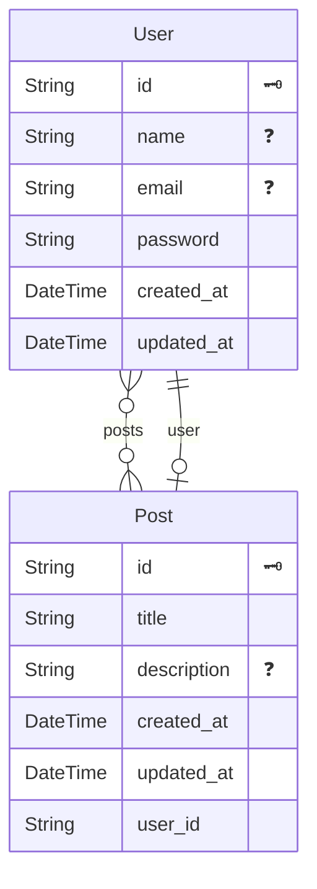

```mermaid
erDiagram

  "User" {
    String id "🗝️"
    String name "❓"
    String email "❓"
    String password 
    DateTime created_at 
    DateTime updated_at 
    }
  

  "Post" {
    String id "🗝️"
    String title 
    String description "❓"
    DateTime created_at 
    DateTime updated_at 
    String user_id 
    }
  
    "User" o{--}o "Post" : "posts"
    "Post" o|--|| "User" : "user"
```
